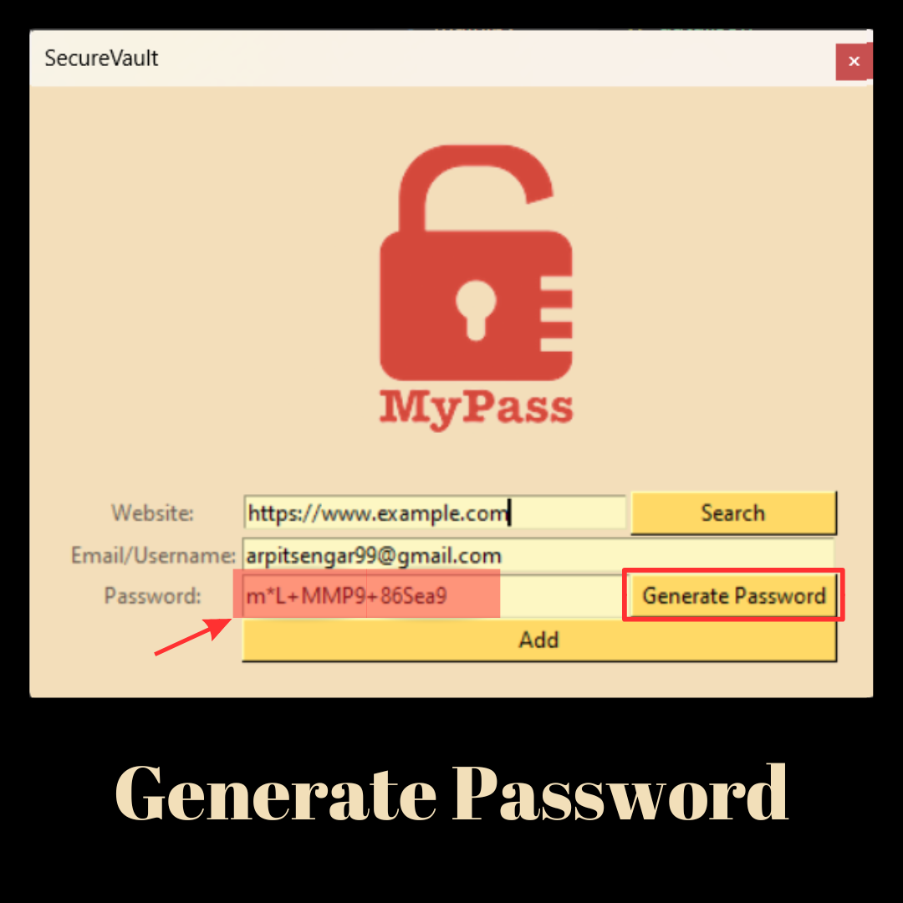

# SecureVault - Password Manager
SecureVault is a secure and convenient way to store all of your login information for various websites and applications. The app you have made in Python is designed to help users easily save, manage and access their passwords, while keeping them safe from prying eyes.

The app interface is simple and intuitive, with options for users to add, edit, or delete their login credentials for different websites and applications.

When a user adds a new password, they can enter the website and the password. The app then stores this information in a json file.

Users can also generate strong, unique passwords for their accounts using the app's password generator feature. This ensures that their accounts are protected from hackers who may use automated tools to guess passwords.

In addition, the app includes a search function that allows users to quickly find the login credentials for a particular website or application. Users can also view all of their saved passwords.

Overall, my password saver app is a reliable and secure tool for managing and protecting passwords.

## Features
SecureVault allows the user to specify the length of the password they want to generate. The program generates a password that contains a mix of lowercase and uppercase letters, numbers, and special characters.

## Images
<table>
    <tr>
        <td></td>
        <td></td>
    </tr>
    <tr>
        <td></td>
        <td></td>
    </tr>
</table>

## Demo


## Installation
1. Clone the repository to your local machine.
    ```bash
    git clone https://github.com/arpitsengar99/SecureVault
    ```

2. Navigate to the project directory.
    ```bash
    cd SecureVault
    ```  

3. Run the program.
    ```bash
    python SecureVault.py
    ```

## Usage
<ol>
    <li>Run the program by following the installation instructions above.</li>
    <li>Enter the desired length of your password.</li>
    <li>Press Generate to generate a new password.</li>
    <li>Use the generated password to secure your online accounts.</li>
</ol>

## Contributing
If you would like to contribute to this project, please fork the repository and submit a pull request. We welcome any contributions or suggestions!

## Authors
- [@arpitsengar99](https://www.github.com/arpitsengar99)


